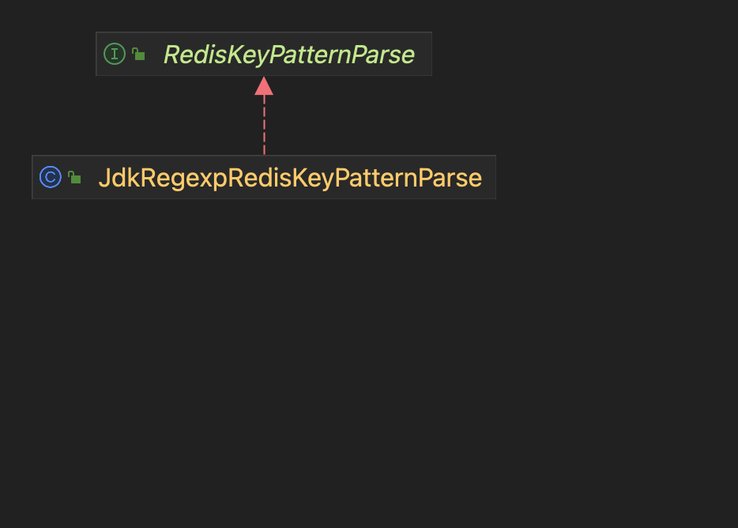

# redis-metrics
## 目的
想根据redis keyPattern进行统计，以评估每个key的访问量和rt，用来获取热key等信息，以便进行优化

### 现有的metrics
lettuce自带metrics，但只统计到command的纬度，没有具体的key tag

[lettuce metics](https://lettuce.io/core/release/api/io/lettuce/core/metrics/package-summary.html)

## 需求
1. 按照keyPattern统计
2. tag至少含command,key,exception
3. 尽可能的无侵入式

## 实现
### keyPattern聚合
例如keyPattern = user:%s，具体的key为user:1、user:2 ....，如果直接将具体的key统计成tag，会导致tag数量异常的多，将会引发outOfMemory，所以要按照keyPattern进行聚合


* RedisKeyPatternParse: 用于将原始key解析成keyPattern
* JdkRegexpRedisKeyPatternParse: Jdk正则转换

示例：

定义key pattern常量类
```
public class RedisKeyConstantTest {
    public static String USER_KEY = "user:%s";
}
```

初始化RedisKeyPatternParse，解析原始key对应的keyPattern
```
    protected RedisKeyPatternParse redisPatternParse = new JdkRegexpRedisKeyPatternParse(RedisKeyConstantTest.class);
    
    @Test
    void exist_parse() {
        Optional<String> keyPattern = redisPatternParse.parse("user:11");
        assertEquals("user:.*", keyPattern.orElse(null));
    }
```

### 集成到现有框架中
现有项目都是通过redisTemplate操作redis
```
redisTemplate.opsForValue().set("user:1","aaaaaa")
```

redisTemplate源码
```
public class RedisTemplate<K, V> extends RedisAccessor implements RedisOperations<K, V>, BeanClassLoaderAware {

	private final ValueOperations<K, V> valueOps = new DefaultValueOperations<>(this);
	
	@Override
	public ValueOperations<K, V> opsForValue() {
		return valueOps;
	}
```

思考：
想无侵入式的对redisTemplate进行增强，可以生成ValueOperations的代理对象，redisTemplate.opsForValue()返回代理对象，
但valueOps被private final修饰，无法替换

所以换个思路：
1. 创建redisTemplate代理对象，拦截opsForValue方法，返回代理的ValueOperations
2. valueOperations也是代理对象，方法执行前后会调用redisMetrics进行统计
3. redisMetrics会调用RedisKeyPatternParse解析keyPattern


## 实现
定义RedisTemplateAspect，拦截opsFor方法，创建对应对代理对象
```
@Aspect
public class RedisTemplateAspect {
    ...

    @Pointcut("execution(public * org.springframework.data.redis.core.RedisTemplate.opsFor*())")
    public void operationPointCut() {

    }

    @Around("operationPointCut()")
    public Object aroundOpsFor(ProceedingJoinPoint joinPoint) throws Throwable {
        Object result = joinPoint.proceed();
        if (needProxy(result)) {
            return operationProxyCache.computeIfAbsent(result, (re) -> {
                ProxyFactory proxyFactory = new ProxyFactory(result);
                proxyFactory.addAdvice(redisOperationMethodInterceptor);
                return proxyFactory.getProxy();
            });
        }
        return result;
    }
    ...

```

创建ValueOperations的代理，ValueOperations执行前后会通过redisMetrics进行统计
```
public class RedisOperationMethodInterceptor implements MethodInterceptor {

    private static final Logger LOG = LoggerFactory.getLogger(RedisOperationMethodInterceptor.class);

    private final RedisMetrics redisMetrics;

    public RedisOperationMethodInterceptor(RedisMetrics redisMetrics) {
        this.redisMetrics = redisMetrics;
    }

    @Override
    public Object invoke(MethodInvocation invocation) throws Throwable {
        Object[] arguments = invocation.getArguments();
        boolean needMetrics = arguments.length > 0 && arguments[0] instanceof String;
        if (!needMetrics) {
            return invocation.proceed();
        }

        long start = System.currentTimeMillis();
        Object result;
        String key = (String) arguments[0];
        String command = invocation.getMethod().getName();
        try {
            result = invocation.proceed();
        } catch (Exception e) {
            LOG.warn("redis execute error", e);
            redisMetrics.metrics(key, command, System.currentTimeMillis() - start, e);
            throw e;
        }
        redisMetrics.metrics(key, command, System.currentTimeMillis() - start, null);
        return result;
    }
}

```

RedisMetrics通过redisPatternParse提取keyPattern，进行统计
```
public class RedisMetrics {
   ...
     public void metrics(String originalKey, String command, long cost, Exception e) {
        Optional<String> parseResultOptional = redisPatternParse.parse(originalKey);
        if (parseResultOptional.isPresent()) {
            doMetrics(parseResultOptional.get(), command, cost, e);
        } else {
            doMetrics("UNKNOWN", command, cost, e);
            LOG.debug(
                    "not found key, originalKey:{}, redisPatternParse:{}",
                    originalKey,
                    redisPatternParse.getClass().getSimpleName());
        }
    }
```


## 结果
```
redis_seconds_count{command="set",exception="None",key="user:.*",} 1.0
```


